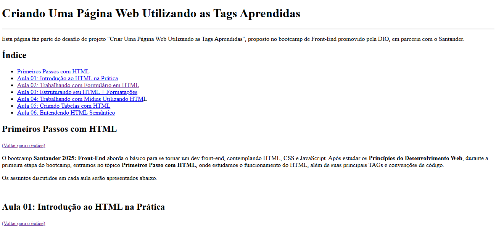

# Criar uma Página Web Utilizando as Tags Aprendidas 

### 💭 Entendendo o Desafio

> 🔍 Repositório Base: [trilha-html-modulo-1](https://github.com/digitalinnovationone/trilha-html-modulo-1/tree/main)

A ideia deste Desafio de Projeto é elaborar um website, utilizando uma estrutura bem básica, utilizando tags aprendidas durante as aulas práticas:
* Utilizar todas as tags explicadas nas aulas: h1 até h6, p, mark, small, i, u, strong, ol, ul, li, a, hr, sub, sup, blockquote.
* Utilizar novas tags sugeridas: font, del, p, abbr. A ideia é buscar estas tags na internet, entender como funcionam e utilizar no texto.

### 🖥️ Resultado

Como proposto, foi criada uma página utilizando apenas HTML e as TAGs aprendidas ao longo do curso **Primeiros Passos com HTML**. O resultado final pode ser visualizado por meio do Live Server. 

Na página, há uma breve introdução sobre o curso, e em seguida os assuntos aprendidos em cada uma das aulas são discutidos e exemplificados.

