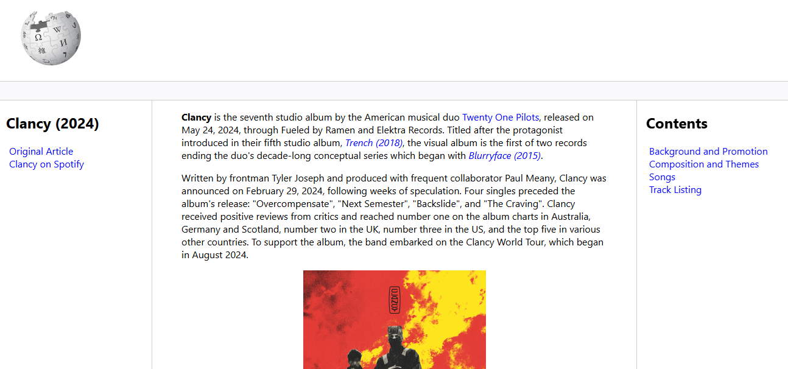

# Recriando o Wikipedia com Layout Moderno

### 📌 Objetivo

> 🔍 Repositório Base: [trilha-html-modulo-3](https://github.com/digitalinnovationone/trilha-html-modulo-3/tree/main)

Este desafio consiste em treinar você com relação a estrutura do site, e também aplicar conhecimentos adiquiridos sobre semântica e acessibilidade.

### 🖥️ Resultado

A partir [deste artigo]("https://en.wikipedia.org/wiki/Clancy_(album)") da Wikipedia, foi construída uma página web com HTML, e um pouco de CSS, com o intuito de explorar melhor as questões de semântica e acessebilidade. Assim, ao invés de utilizar tags genéricas, a página é estruturada com tags mais descritivas, priorizando a legibilidade e manutenabilidade do código. 

O resultado final pode ser visualizado por meio do Live Server.

